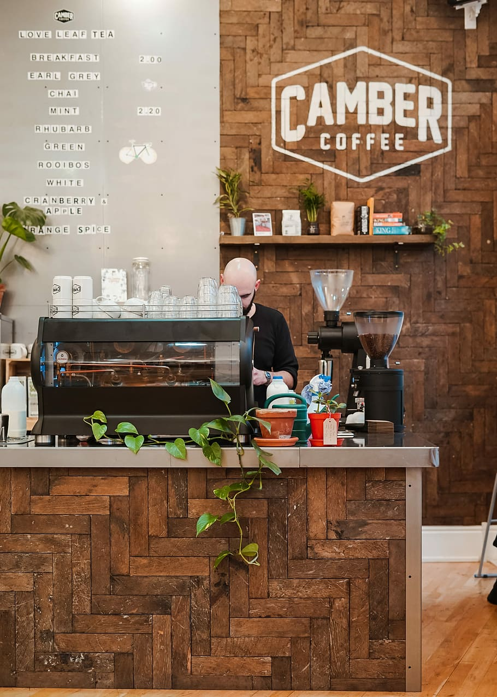

# ☕ Coffee Shop Sales Analysis using MySQL

  

## Project Overview
Analyze transaction records for Maven Roasters, a fictitious coffee shop operating out of three NYC locations using MySQL to uncover sales trends, product performance, store performance, and business insights.

## Dataset

Source: Maven Analytics Coffee Shop Sales Dataset

## Tools Used

- MySQL
- MySQL Workbench
- Git
- GitHub

## Database Schema

(ER Diagram will be added here)

## Project Workflow

Project Workflow

1. Database Setup
2. Data Import
3. Data Validation
   • Checked for NULL values
   • Verified duplicate records
   • Validated data types
   • Checked date ranges
   • Validated quantity and unit price values
4. Exploratory Data Analysis
   • Dataset overview
   • Revenue metrics
   • Transaction metrics
   • Store metrics
5. Business Analysis
   • Sales trends
   • Store performance
   • Product performance
   • Peak sales hours
   • Monthly growth

## Key SQL Concepts

- Aggregate Functions
- GROUP BY
- CASE
- CTEs
- Window Functions
- Date Functions
- Ranking Functions

## Folder Structure

(sql, dataset, images)

## Results

(You'll add screenshots later.)

## Future Improvements

- Power BI Dashboard
- Stored Procedures
- Views
- Index Optimization